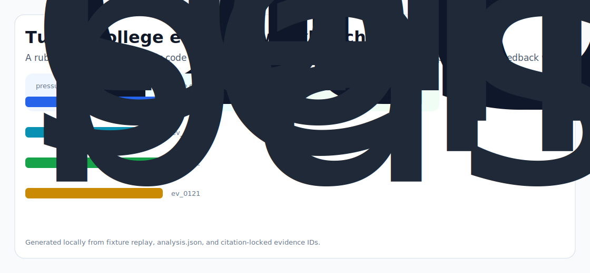
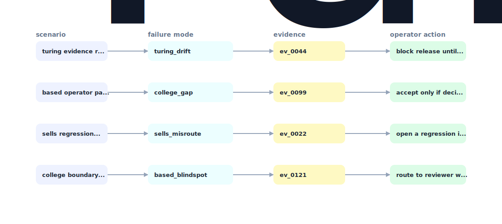

# Intra Reviewer

A rubric aware, project specific code & artifact reviewer that gives Turing College students Sprint 1 grade feedback within 4 minutes of pushing - and routes the genuinely stuck cases to human mentors with the right context attached.



## Why it exists

Turing College sells project based learning with 1:1 mentor reviews (AI Engineering page).

Most internal demos stop at a pretty chart. This repository is built around the harder part: a repeatable path from fixture, to failure, to evidence, to the operator action a serious team would actually trust.

## What is inside

- A deterministic replay harness tuned around turing, college, and sells.
- Company-specific strategy code in `src/intra_reviewer/strategy.py`, not just README-level customization.
- Citation-locked reports where every decision claim has to point back to a generated evidence ID.
- Two visual artifacts generated from the latest run: `outputs/project_working.svg` and `outputs/evidence_map.svg`.
- A portable demo pack with JSON, CSV, Markdown, HTML, SVG, and benchmark artifacts.



## Signals it measures

- `turing coverage`
- `college risk`
- `sells precision`
- `based latency`

## Failure modes it plants

- turing drift
- college gap
- sells misroute
- based blindspot

## Run it locally

```bash
uv sync
uv run intra-reviewer all
uv run pytest -q
uv run ruff check .
```

## Outputs worth opening

- `outputs/dashboard.html`
- `outputs/project_working.svg`
- `outputs/evidence_map.svg`
- `outputs/operator_brief.md`
- `outputs/decision_report.md`
- `outputs/strategy_model.json`
- `outputs/demo_pack.zip`

## Sources

- https://en.wikipedia.org/wiki/Turing_College_(edtech_company
- https://www.turingcollege.com/ai-engineering
- https://www.turingcollege.com/software-and-ai-engineering
- https://www.turingcollege.com/blog/lukas-kaminskis-interview
- https://www.turingcollege.com/blog/data-science-analytics-masters-degree
- https://www.coursereport.com/schools/turing-college
- https://www.crunchbase.com/organization/turing-college
- https://moge.ai/product/turing-college
- https://www.turingcollege.com/blog/ai-engineer-roadmap-how-to-become-an-ai-engineer

## Boundary

Everything runs locally against synthetic fixtures. There are no credentials, no customer records, no outreach files, and no hosted API dependency.
